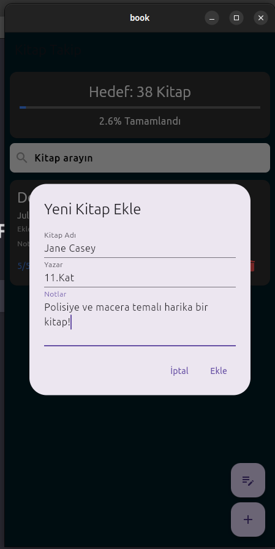
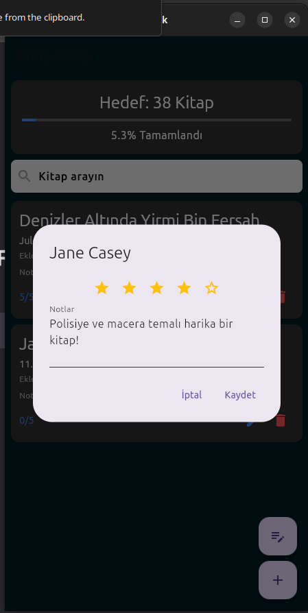
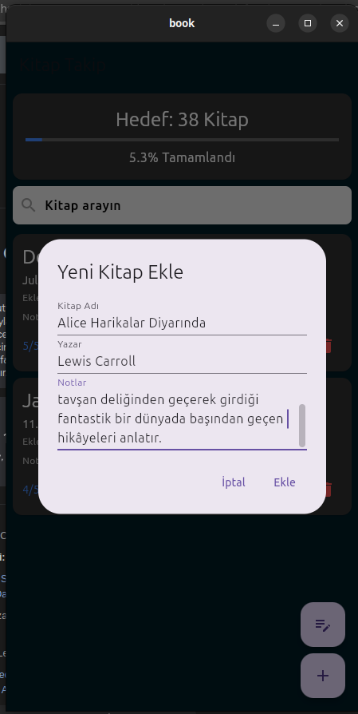
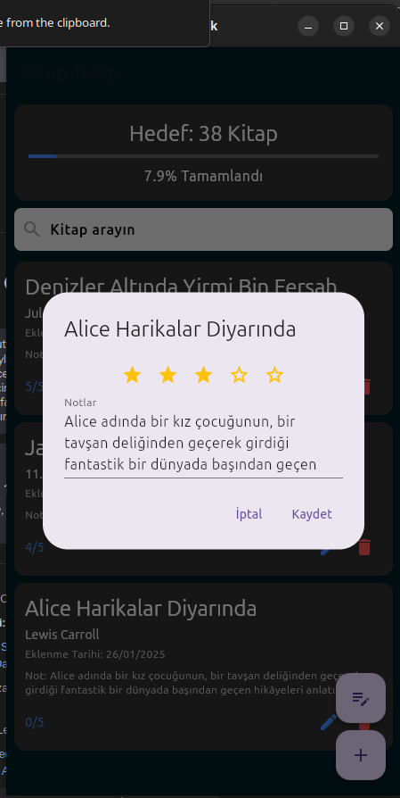
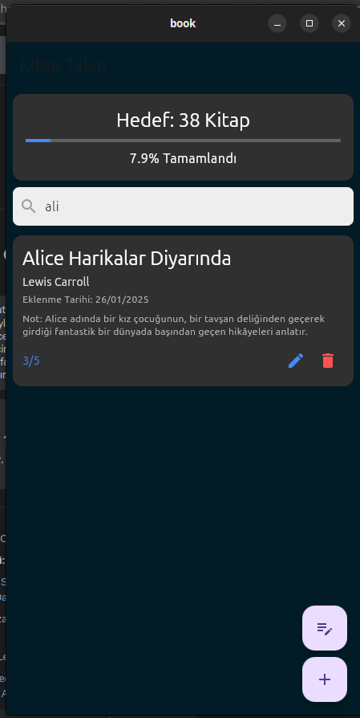

# Kitap Takip Uygulaması

Bu proje, kitaplarınızı takip etmek ve okuma hedeflerinizi düzenlemek için bir uygulamadır.

## Özellikler
- Okunan kitapları listeleme
- Okuma hedefi belirleme
- Kitaplara not ekleme ve düzenleme

## Ekran Görselleri

### Kitap Görselleri
Aşağıda uygulamaya ait görseller bulunmaktadır:








---

### Kurulum
1. Bu projeyi klonlayın:
   ```bash
   git clone https://github.com/mustafaemirata/KitapTakip.git
